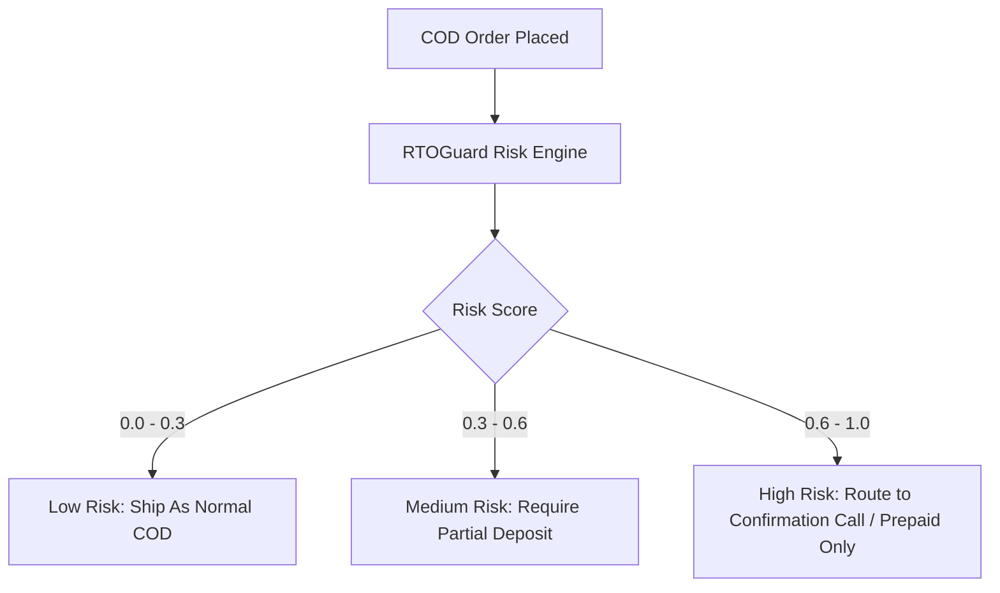
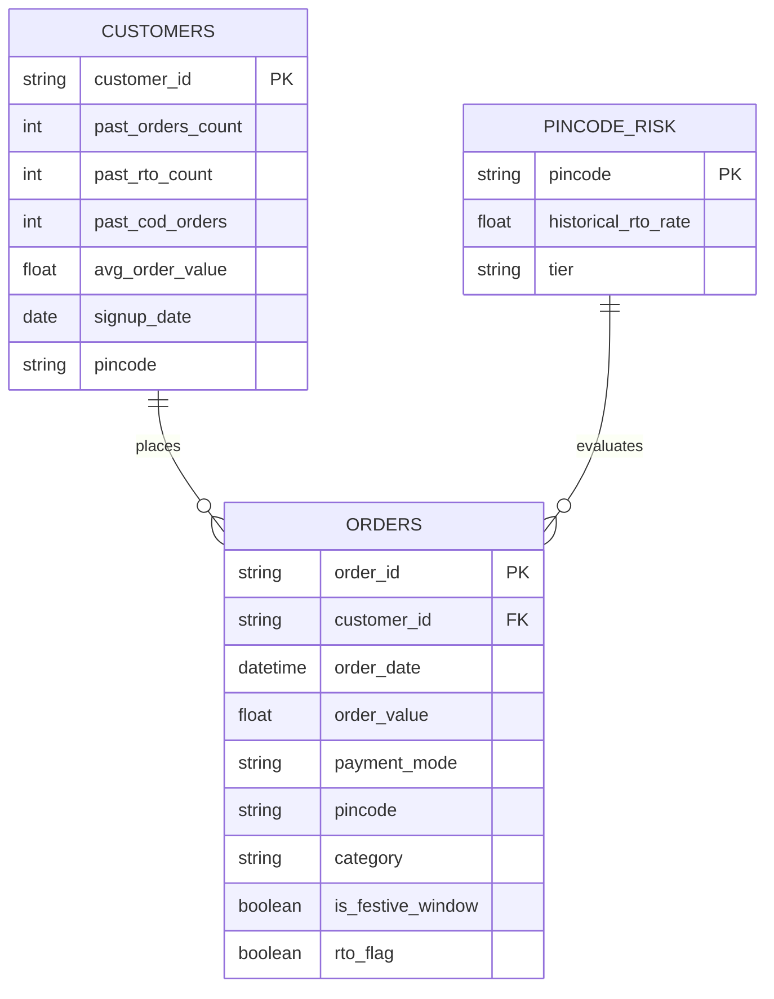
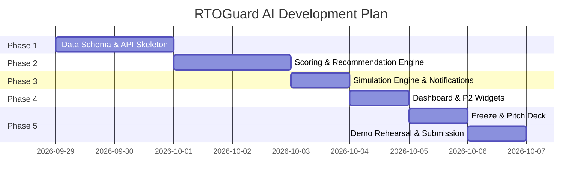

# Product Requirements Document (PRD): RTOGuard AI

**Version:** 1.0  
**Track:** Hackathon — OpsGenieAI Track  
**Timeline:** 8 Days  
**Status:** Internal Draft  

---

## Executive Summary & Tagline

> **"Every COD order is effectively an unsecured loan."**  
> **RTOGuard AI** scores each Cash-on-Delivery (COD) order for default/Return-to-Origin (RTO) risk at the point of checkout and recommends an operational decision: **Ship As-Is**, **Request Partial Prepaid Deposit**, or **Route to Confirmation Call** — stopping financial leakage *before* logistics costs are incurred.

---

## 1. Problem Statement

Indian Direct-to-Consumer (D2C) brands experience high Return-to-Origin (RTO) rates ranging between **20% and 35%**, driven predominantly by Cash-on-Delivery (COD) orders (~26% RTO for COD vs. <2% for prepaid).

### Financial Impact per Returned Parcel:
- **Direct Reverse Logistics Cost:** ₹150 – ₹300
- **Total Write-off Cost (including CAC):** ₹450 – ₹900 per order
- **Festive Window Risk:** 30%–35% of annual D2C revenue occurs during Navratri/Diwali, compounding RTO loss during high-volume periods.

### Current Limitations:
1. **Blind Acceptance:** Accepting all COD orders without verification.
2. **Blunt Rules:** Rigid policies (e.g., "Block COD above ₹2,000") that turn away good customers while missing high-risk smaller orders.
3. **Unused Signal:** Order, customer, and pincode signals already present in brand databases remain unutilized at checkout.

---

## 2. Metrics & Industry Baselines

| Metric | Industry Baseline | Target Impact |
| :--- | :--- | :--- |
| **Overall RTO Rate** | 20% – 35% | Reduced to ~15% – 19% |
| **COD RTO Rate** | ~26% | Dynamic action mitigation |
| **Prepaid RTO Rate** | < 2% | Benchmark reference |
| **Cost per RTO Order** | ₹450 – ₹900 | Financial loss prevented |
| **Primary KPI** | Unmonitored | **₹ Saved per 1,000 Orders** |

---

## 3. Product Goals & Non-Goals

### Core Goals:
1. **Real-time Checkout Risk Scoring:** Evaluate COD risk (`0.0` to `1.0`) at checkout.
2. **Actionable 3-Tier Decision Engine:** Convert raw risk scores into immediate operational recommendations.
3. **Quantifiable ROI Calculator:** Measure ₹ saved per 1,000 orders comparing baseline vs. AI-intervened orders.
4. **Multi-Track OpsGenie Coverage:** Natively cover Efficiency, Forecasting, and Business Processes, with modular extensions for Inventory, Customer Service, and Resource Utilization.

### Non-Goals (Out of Scope for Hackathon):
- Live payment gateway integration / real money collection for deposits.
- Live telephony/dialer integration (confirmation calls are flagged in queue, not auto-dialed).
- Multi-tenant SaaS architecture (single demo brand scope).
- Training on live/proprietary brand data (realistic synthetic dataset used and labeled).

---

## 4. Target User Profile

- **Target Persona:** Operations Manager / Growth Lead at a D2C Brand.
- **Usage Scenario:** Morning dashboard review during peak festive campaigns or automated webhooks integrated into e-commerce checkout flows (Shopify/WooCommerce).

---

## 5. Core Concept: 3-Tier Decision Matrix

| Risk Score Range | Risk Level | Recommended Action | Operational Rationale |
| :--- | :--- | :--- | :--- |
| **0.0 – 0.3** | Low | Ship as Normal COD | High trust profile; zero checkout friction. |
| **0.3 – 0.6** | Medium | Partial Prepaid Deposit | Secures buyer intent without canceling the sale. |
| **0.6 – 1.0** | High | Confirmation Call / Prepaid Only | High default probability; requires manual verification before dispatch. |

---

## 6. Functional Requirements & Feature Prioritization

### 6.1 Risk Scoring Engine `[P0]`
- **Inputs:** Customer order history (order count, past RTO count), order value, payment mode, pincode, product category, festive window flag.
- **Output:** `risk_score` float (`0.0` to `1.0`).
- **Methodology:** Transparent weighted feature scoring model with clear feature explainability.

### 6.2 Action Recommendation Engine `[P0]`
- Maps `risk_score` to one of the 3 actions.
- Generates human-readable decision explanations (e.g., *"New customer + Tier-3 pincode + High Order Value"*).

### 6.3 Cost Impact Calculator `[P0]`
- Calculates expected loss per order:  
  $$\text{Expected Loss} = \text{Estimated RTO Cost (Logistics + CAC)} \times \text{P(RTO)}$$
- Aggregates metrics across order batches.

### 6.4 Replay Simulation Engine `[P0]`
- Executes a dual-pass simulation on order batches:
  1. **Pass A (Baseline):** No intervention (all COD orders shipped).
  2. **Pass B (AI-Enabled):** RTOGuard recommendations applied.
- **Output:** Net ₹ saved and percentage reduction in RTO losses.

### 6.5 Interactive Operations Dashboard `[P1]`
- Live order queue displaying risk badges, score details, and recommended actions.
- Side-by-side simulation comparison panel.
- Festive-window toggle for risk distribution stress-testing.

### 6.6 Real-Time WhatsApp Alerts `[P1]`
- Sends instant notifications for high-risk flags (e.g., *"🚨 Order #4521 — 78% RTO Risk — Recommend Deposit"*).

### 6.7 Track Coverage Extensions `[P2]`
- **Inventory Protection:** Quantifies locked stock inventory in high-risk COD transit (>60% risk).
- **Customer Service Queue:** Automatically routes high-risk orders to agent verification queues with contextual scripts.
- **Resource Utilization:** Compares call queue volume against available agent capacity.

---

## 7. Data Architecture & Schema

---

## 8. API Specification

| Endpoint | Method | Input Parameters | Output Response |
| :--- | :--- | :--- | :--- |
| `/api/score-order` | `POST` | Order payload (Customer ID, Value, Pincode, Category, Festive Flag) | `risk_score`, `recommended_action`, `reason_string` |
| `/api/orders/high-risk` | `GET` | `limit`, `threshold` | List of flagged high-risk orders with metadata |
| `/api/simulate` | `GET` | `batch_size`, `festive_mode` | Baseline cost, AI cost, net ₹ saved, RTO % change |
| `/api/dashboard/summary` | `GET` | None | Total orders, overall RTO rate, ₹ at risk, festive breakdown |

---

## 9. Success Criteria & KPIs

1. **Primary KPI:** Demonstrate concrete **₹ saved per 1,000 orders** in simulation demo.
2. **Secondary KPI:** Reduction in simulated RTO rate (e.g., **32% → 19%**).
3. **Track Coverage KPI:** Successfully demonstrate 5+ of 7 hackathon track criteria live during evaluation.

---

## 10. Risk Management & Mitigations

| Identified Risk | Impact | Mitigation Strategy |
| :--- | :--- | :--- |
| **Judge skepticism on RTO cost figures** | Medium | Cite standard ecommerce logistics & acquisition benchmark studies. |
| **Synthetic data looking artificial** | High | Introduce non-linear distributions, pincode variance, and realistic noise into synthetic generators. |
| **Simulation showing minimal delta** | High | Calibrate feature weight matrix to ensure intervention threshold visibly reduces default rates. |
| **Feature scope creep** | Medium | Freeze P0/P1 scope on Day 2; treat P2 items as strictly additive modules. |

---

## 11. Implementation Roadmap (8-Day Plan)

---

*RTOGuard AI — OpsGenieAI Hackathon PRD Document*
