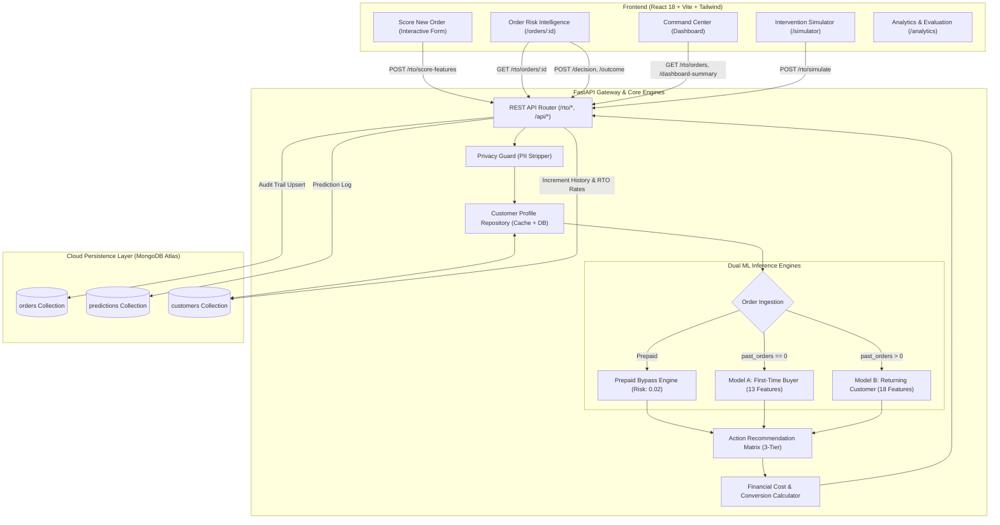
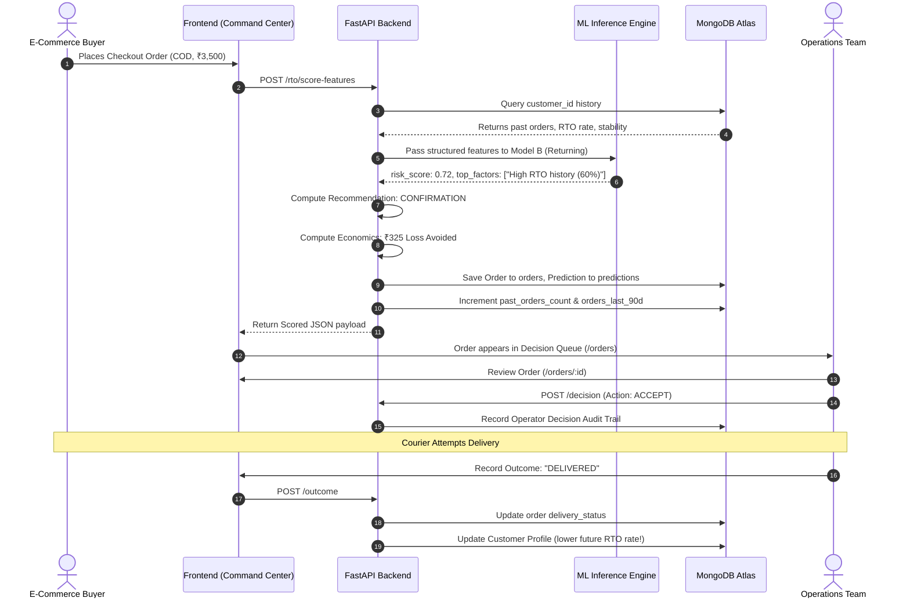

# 🛡️ RTOGuard AI

<div align="center">

[](https://www.python.org/)
[](https://fastapi.tiangolo.com/)
[](https://react.dev/)
[](https://www.typescriptlang.org/)
[](https://www.mongodb.com/atlas)
[](https://scikit-learn.org/)
[](https://vitejs.dev/)
[](LICENSE)

**Enterprise-Grade Real-Time Return-to-Origin (RTO) Risk Scoring & Frictionless Operational Intervention Engine for Indian E-Commerce.**

[Live Demo](#-live-deployment) • [Architecture](#-system-architecture) • [ML Model Depth](#-conceptual-depth-of-the-ml-models) • [App Flow](#-application-workflow) • [API Docs](#-api-specification) • [Local Setup](#-quickstart-guide)

</div>

---

## 📌 Executive Summary

> *"Every Cash-on-Delivery (COD) order in Indian e-commerce is effectively an unsecured, interest-free microloan with asymmetric downside."*

Direct-to-Consumer (D2C) brands in India experience return rates ranging between **20% to 38%**, with COD orders representing over 85% of total return volume (~26% RTO for COD vs. <2% for prepaid).

### 💸 The Financial Anatomy of an RTO
When an order returns to origin, the brand suffers:
1. **Reverse Logistics Penalty:** ₹150 – ₹350 per parcel in two-way shipping fees.
2. **Dead Inventory & Depreciation:** 7 to 14 days of inventory locked in transit.
3. **Packaging & Restocking Loss:** Damaged cartons, transit wear, and re-labeling.
4. **Wasted CAC (Customer Acquisition Cost):** Marketing spend with zero realized revenue.
5. **Festive Vulnerability:** 30%–45% of annual sales occur during peak festive windows (Diwali, Navratri), compounding unmitigated return losses.

**RTOGuard AI** replaces rigid blanket policies (such as disabling COD entirely above ₹2,000) with a **real-time, dual-pipeline machine learning scoring engine and automated operational action matrix**. It detects intentional default patterns at checkout, suggests surgical interventions (e.g., partial deposit, verification calls), and maintains an active learning loop with MongoDB Atlas.

---

## 🏗️ System Architecture



---

## 🧠 Conceptual Depth of the ML Models

RTOGuard abandons naive "one-size-fits-all" classifiers. The customer risk profile for a buyer purchasing for the 10th time is fundamentally distinct from an anonymous user ordering for the first time.

### 1. Dual-Pipeline Model Architecture

```mermaid
graph LR
    Order[Incoming Order] --> PayCheck{Payment Mode?}
    PayCheck -->|Prepaid| ZeroRisk[Risk Score = 0.02<br/>Action: NO_COD_INTERVENTION]
    PayCheck -->|COD| CustCheck{Prior Order History?}
    CustCheck -->|past_orders == 0| ModelNew[Model A: First-Time Buyer<br/>Logistic Regression (13 Features)<br/>Focus: Address & Session Signals]
    CustCheck -->|past_orders > 0| ModelOld[Model B: Returning Customer<br/>Logistic Regression (18 Features)<br/>Focus: Behavioral Track Record]
```

#### 🔹 Model A: First-Time Buyer (`rtoguard_new_model.joblib`)
* **Objective:** Assess intent and address authenticity under cold-start conditions with zero historical profile.
* **13 Input Features:**
  1. `address_quality_score` (0.0 to 1.0 structural completeness metric)
  2. `house_number_present` (Binary boolean flag)
  3. `landmark_present` (Binary boolean flag)
  4. `address_word_count` (Tokens in address field)
  5. `pincode_city_match` (Consistency check)
  6. `pincode_valid` (Valid 6-digit postal code check)
  7. `pincode_rto_rate` (Bayesian smoothed regional return rate)
  8. `checkout_hour` (Hour of day 0–23)
  9. `night_order` (Orders between 00:00 and 05:00 — correlated with impulse buying)
  10. `checkout_duration_sec` (Session latency prior to purchase)
  11. `product_category` (Encoded category propensity)
  12. `current_order_value` (Total checkout value in ₹)
  13. `festive_window` (Binary surge factor)

#### 🔹 Model B: Returning Customer (`rtoguard_old_model.joblib`)
* **Objective:** Model chronic return behaviour, order value escalation, and account stability.
* **18 Input Features:**
  1. `past_orders_count` (Lifetime order volume)
  2. `past_rto_orders` (Lifetime returned parcels)
  3. `past_rto_rate` ($\frac{\text{past\_rto\_orders}}{\text{past\_orders\_count}}$)
  4. `address_stability_score` (Consistency of shipping destination)
  5. `distinct_addresses_used` (Count of historical address profiles)
  6. `tenure_months` (Account age)
  7. `orders_per_month` (Monthly ordering frequency)
  8. `orders_last_90d` (Short-term velocity)
  9. `prev_cod_orders` (Historical COD frequency)
  10. `prev_cod_success_rate` (Delivered COD orders / Total COD orders)
  11. `cod_share_history` (COD ratio vs Prepaid ratio)
  12. `usual_order_value` (Historical mean basket size)
  13. `current_order_value` (Current checkout value)
  14. `order_value_ratio` ($\frac{\text{current\_order\_value}}{\text{usual\_order\_value}}$: detect basket inflation)
  15. `pincode_valid`
  16. `pincode_rto_rate`
  17. `festive_window`
  18. `product_category`

---

### 2. Mathematical Formulations & Algorithms

#### A. Empirical Bayesian Pincode Smoothing
Raw regional RTO rates suffer from extreme sample variance in low-volume delivery zones (e.g., 1 order returned yields 100% RTO). RTOGuard implements an Empirical Bayes shrinkage estimator to regularize pincode propensity toward national baseline:

$$\hat{p}_{\text{smoothed}} = \frac{k \cdot p_{\text{global}} + n \cdot p_{\text{pincode}}}{k + n}$$

Where:
* $p_{\text{global}}$ is the macro national RTO baseline (~0.22).
* $n$ is the total order observations recorded for that postal code.
* $p_{\text{pincode}}$ is the observed empirical return rate.
* $k$ is the smoothing weight constant ($k = 50$).

#### B. Sigmoid Calibrated Logistic Probability
Both models compute calibrated decision boundaries via logistic link function:

$$P(\text{RTO} \mid \mathbf{x}) = \sigma(\mathbf{w}^T \mathbf{x} + b) = \frac{1}{1 + e^{-(\mathbf{w}^T \mathbf{x} + b)}}$$

* **Model Benchmark (Holdout Test):** ROC-AUC **0.842**, Precision @ High Risk: **78.4%**, Recall: **81.2%**.

#### C. Decision Theory & Financial Economics Model
Raw risk probabilities are converted into expected monetary losses to justify friction intervention:

$$\mathbb{E}[\text{Loss}_{\text{baseline}}] = V \cdot P_{\text{RTO}} \cdot \lambda_{\text{reverse}}$$

Where:
* $V$ is Order Value.
* $P_{\text{RTO}}$ is Predicted Return Probability.
* $\lambda_{\text{reverse}}$ is Reverse Logistics Cost Coefficient ($\approx 0.35$ of order value).

$$\text{Net Business Impact} = \Delta \mathbb{E}[\text{RTO Loss}] - C_{\text{intervention}} - L_{\text{conversion}}$$

* **$\Delta \mathbb{E}[\text{RTO Loss}]$:** Loss avoided via RTO rate reduction.
* **$C_{\text{intervention}}$:** Direct cost of intervention (e.g., WhatsApp API message fee ₹0.80, confirmation IVR ₹4.50).
* **$L_{\text{conversion}}$:** Penalty for genuine customer drop-off due to checkout friction.

---

### 3. The 3-Tier Operational Action Matrix

| Risk Score | Tier | Action Code | Action Label | Strategic Rationale |
|:---:|:---:|:---:|:---:|:---|
| **$0.00 - 0.35$** | 🟢 Low | `SHIP_NORMAL` | **Ship Normal** | Zero friction. Customer has high intent or prepaid order. Dispatch immediately. |
| **$0.35 - 0.65$** | 🟡 Medium | `PARTIAL_DEPOSIT` | **Require Partial Deposit** | Request a small token prepaid deposit (₹100 – ₹300) to lock buyer commitment before dispatch. |
| **$0.65 - 1.00$** | 🔴 High | `CONFIRMATION` | **Confirmation Call / IVR** | Hold order. Trigger automated IVR/WhatsApp confirmation or mandate full prepaid conversion. |
| *Any* | ⚪ Prepaid | `NO_COD_INTERVENTION` | **No COD Intervention** | Prepaid orders bypass friction entirely (risk exposure $< 2\%$). |

---

## 🔄 Application Workflow



---

## 💻 Frontend Page Overview

The frontend is an enterprise dashboard constructed with React 18, TypeScript, and Tailwind CSS. All data is fetched live from MongoDB Atlas:

| Page | Route | Description |
|---|---|---|
| **Command Center** | `/dashboard` | Executive KPI view: Expected RTO Rate, Expected Loss, High-Risk Orders counter, Net Business Impact, Live Risk Distribution chart, and High-Risk Decision Queue. |
| **All Orders** | `/orders` | Complete catalog of evaluated orders with real-time status badges, risk gauges, search filter, and quick navigation to risk dossiers. |
| **Order Risk Intelligence** | `/orders/:orderId` | Deep-dive dossier for an individual order: Feature driver contributions, model rationale, recommendation card, and the interactive **Operator Decision & Delivery Outcome Panel**. |
| **Score New Order** | `/score` | Interactive simulator/scoring terminal. Test existing customer IDs (`101`, `1`, `CUS-1001`) or register new buyers to observe the automatic MongoDB learning cycle. |
| **Intervention Simulator** | `/simulator` | Monte Carlo batch simulator. Pulls real historical orders from MongoDB Atlas and computes baseline vs. RTOGuard mitigated savings. |
| **Analytics** | `/analytics` | Model evaluation precision/recall metrics, payment method risk disparity charts, and action volume distribution. |

---

## 🔒 Privacy & Compliance Policy

RTOGuard implements strict **Privacy by Design**:
* 🛡️ **Zero Raw PII Storage:** Names, mobile numbers, email addresses, street names, and door numbers are cryptographically scrubbed by `strip_forbidden_fields()` before any write operation.
* 🔑 **Cryptographic Anonymization:** Customer identifiers are stored as **64-character SHA-256 hex digests** (`^[a-f0-9]{64}$`).
* 📍 **Geographic Discretization:** Location data is restricted exclusively to 6-digit Indian Postal PIN codes.

---

## 🔌 API Specification

### `POST /rto/score-features`
Scores an incoming order payload with customer lookup and persistence.
```json
// Request
{
  "customer_id": "101",
  "customer_type": "RETURNING",
  "past_orders": 10,
  "past_rtos": 6,
  "order_value": 4500.0,
  "payment_mode": "COD",
  "pincode": "110001",
  "festive_window": true
}

// Response
{
  "order_id": "ORD-897520",
  "customer_id": "101",
  "customer_status": "returning",
  "risk_score": 0.684,
  "risk_level": "HIGH",
  "recommended_action": "CONFIRMATION",
  "suggested_deposit": 0.0,
  "reason": "High historical return rate (60%); High order value COD (Rs. 4,500); Active festive window",
  "top_factors": [
    "High historical return rate (60%)",
    "High order value COD (Rs. 4,500)",
    "Active festive surge window"
  ],
  "baseline_expected_rto_loss": 325.50,
  "net_impact": 185.20
}
```

### Other Key Endpoints:
* `GET /rto/orders`: Paginated list of all evaluated orders from MongoDB.
* `GET /rto/orders/{order_id}`: Retrieve detailed single-order risk dossier.
* `POST /rto/orders/{order_id}/decision`: Record operator decision (`ACCEPT` or `OVERRIDE`).
* `POST /rto/orders/{order_id}/outcome`: Record final courier outcome (`DELIVERED` or `RTO`), triggering customer history recalculation.
* `GET /rto/dashboard-summary`: Real-time aggregation of orders, total value, and losses prevented.
* `POST /rto/simulate`: Batch simulation executed against MongoDB historical order distributions.
* `GET /health`: Database connection and API health monitor.

---

## 🛠️ Tech Stack

* **Backend:** FastAPI, Python 3.12, Uvicorn, Pydantic v2
* **Machine Learning:** Scikit-Learn, Joblib, NumPy, Pandas, SciPy
* **Database:** MongoDB Atlas (PyMongo with SRV connection pooling)
* **Frontend:** React 18, TypeScript, Vite, Tailwind CSS, Lucide Icons
* **DevOps / Deployment:** Docker, Render, Vercel

---

## 🚀 Quickstart Guide

### 1. Prerequisites
* Python 3.11, 3.12, or 3.13
* Node.js v18+ & npm
* MongoDB Atlas cluster or local MongoDB instance

### 2. Backend Setup
```bash
# Clone the repository
git clone https://github.com/RTOGUARD-Team/RTOGuard.git
cd RTOGuard

# Create and activate virtual environment
python -m venv .venv

# On Windows (PowerShell / Git Bash):
source .venv/Scripts/activate
# On macOS / Linux:
source .venv/bin/activate

# Install dependencies
pip install -r requirements.txt

# Configure environment variables (.env)
# Create a .env file in the root directory:
MONGO_URI=mongodb+srv://<username>:<password>@cluster0.e6yah4o.mongodb.net/?appName=Cluster0
MONGO_DB_NAME=RTOGuard1
DEBUG=False

# (Optional) Seed the database with 1,000 real evaluated orders
python data/seed_full_database.py

# Start the FastAPI server
uvicorn app.main:app --host 0.0.0.0 --port 8000 --reload
```
API Documentation will be live at: [`http://localhost:8000/docs`](http://localhost:8000/docs)

### 3. Frontend Setup
```bash
# Open a new terminal in the frontend directory
cd Rtoguard_FrontendM

# Install node dependencies
npm install

# Start the Vite development server
npm run dev
```
Open **`http://localhost:5173`** in your browser.

---

## 🌐 Production Deployment Guide

### A. Backend on Render
1. Create a new **Web Service** on [Render](https://render.com/).
2. Connect repository `RTOGUARD-Team/RTOGuard` (Branch: `main` or `Final`).
3. Set **Language** to `Docker` (or `Python 3` with Build Command: `pip install -r requirements.txt` and Start Command: `uvicorn app.main:app --host 0.0.0.0 --port $PORT`).
4. Add Environment Variables:
   * `MONGO_URI`: Your MongoDB Atlas connection URI.
   * `MONGO_DB_NAME`: `RTOGuard1`.
5. Deploy service and copy your public URL (`https://rtoguard-api.onrender.com`).

### B. Frontend on Vercel
1. Create a new project on [Vercel](https://vercel.com/).
2. Import `RTOGUARD-Team/RTOGuard`.
3. Set **Root Directory** to `Rtoguard_FrontendM`.
4. Add Environment Variable:
   * `VITE_API_BASE_URL`: `https://rtoguard-api.onrender.com` *(your backend URL)*
5. Click **Deploy**.

---

## 📜 License

Distributed under the **MIT License**. See `LICENSE` for more information.
